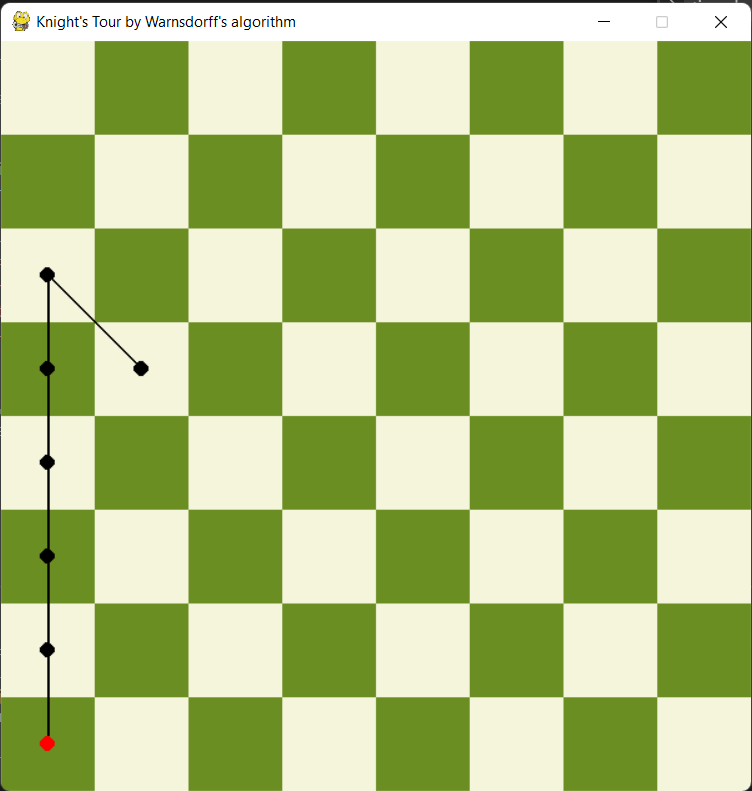
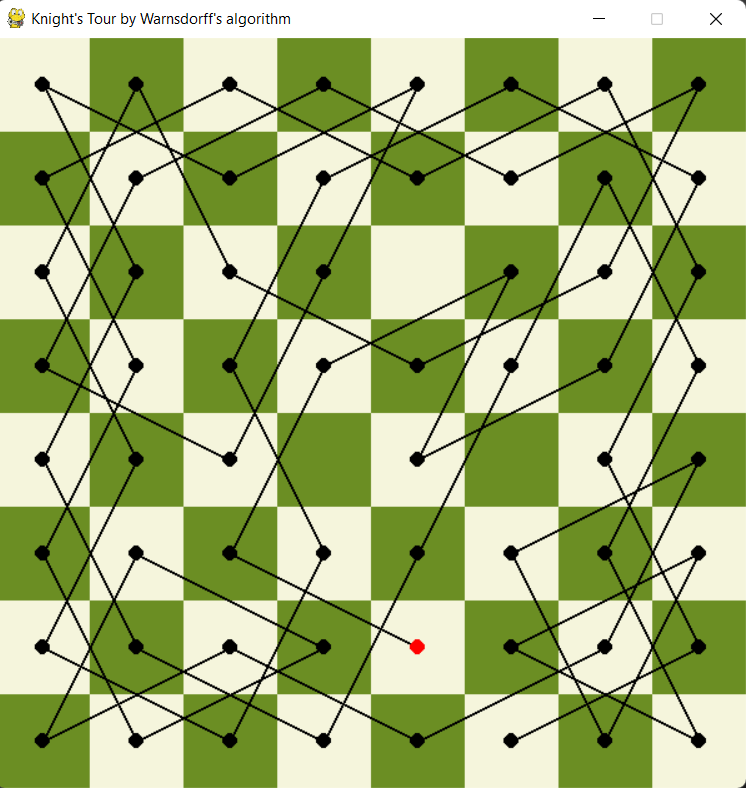

## Knights / Kings Tour - Warnsdorff's algorithm

**Graph Algorithms - 9GRA**

A simple demonstration of a Knights Tour using the Warnsdorff's algorithm. My implementation is no different from other implementations on github. I just used the default python libraries along with PyGame in my implementation. Both *King* and *Knight* movement is implemented. Also included is a ZIP file with an EXE file to run directly from Windows. A classic checkerboard matrix (8 x 8) was chosen, where the starting point is generated randomly.

```javascript
Software
------------------------------------
| Python version 3.10
|   - PyGame version 2.1.2
```

<table>
  <tr>
    <td></td>
    <td></td>
  </tr>
</table>

### Note
If you want to run only the example from the attached ZIP file just run *Knight_Tour.lnk* or directly in the address *Knights_Tour.zip\build\main\main.exe*

:bookmark_tabs: **Source:** [**NiloofarShahbaz - knight-tour-warnsdroff**](https://github.com/NiloofarShahbaz/knight-tour-warnsdroff)