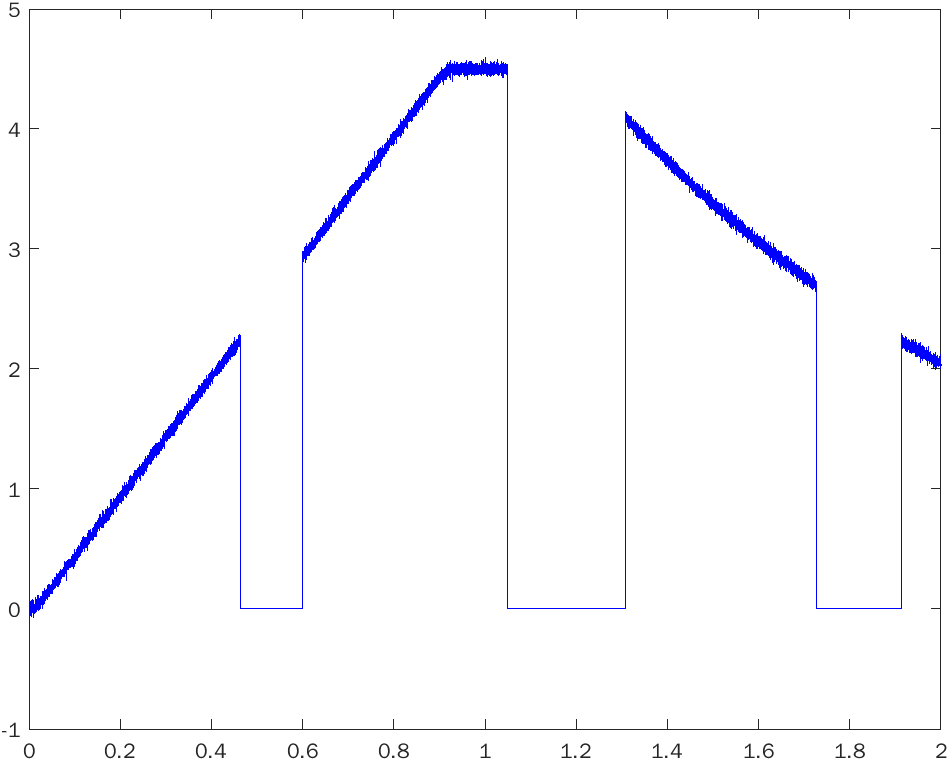

## Identification Nonlinear-System

**Modelling and Identification - MPC-MID**

```javascript
Programming-Language, Toolbox
```
```
Matlab v2021b
```

## Description
The main task it to create script that identify non-linearn system generated to the students in the course. To solve this problem, was used:

* Least Squares Method - Dalayed Observation
* Least Squares Method - Additional model

Input signal:

* PRBS - PseudoRandom Binary Sequence

Additoanl functions:

* Identification of transport delays
* Data segmentation
* Identification of DC component

## Screenshots

<p align="center"> <b>Identification linear part</b> </p>
<b>Note:</b> In the figures below, the maximum linear area can be determined. We determine this in terms of when we look at where the function is increasing until we reach the maximum "volcano". In our case 0.9.




<br>
<br>
<br>
<br>

<p align="center"> <b>Input</b> </p>


<br>
<br>
<br>
<br>

<p align="center"> <b>Identification</b> </p>


<br>
<br>
<br>
<br>

<p align="center"> <b>Validation</b> </p>

