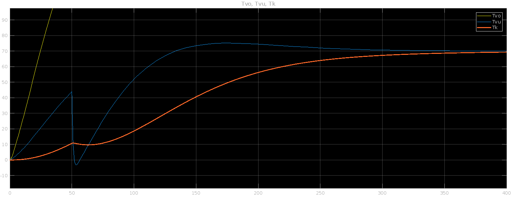

## Simulation of regulation temperature in Home Smokehouse

**Control Theory I - VA1**

```javascript
Software
------------------------------------
| Matlab 2019b
|   - Simulink
```

As part of a course where we dealt with regulation, I created this fun project to regulate the temperature in a home smokehouse. I used Matlab Simulink to solve it, and stand-alone Matlab to define the constants. So to run it, first run the **constants.m** script and then you can run the simulation using Simulink via **smokehouse.slx**.  

**DC-motor** - testing PID regulator, set up by Z-N method (none-part of project, but based on a similar principle I set the control parameters for the smokehouse.)

**Home-smokehouse** - project of simulating, home smokehouse in simulink. Simple approuch of thermal simulation, where is captured all main thermodynamic effects.
The solution is based on the equation:

$$ \Delta Q / \Delta t = - k \cdot A \cdot \Delta T / \Delta R $$ 

* *Q* is heat
* *t* is time
* *A* is the cross-sectional surface area
* *T* is the temperature difference between the ends
* *R* is the distance between the ends

Result of temperature control during smoking:

