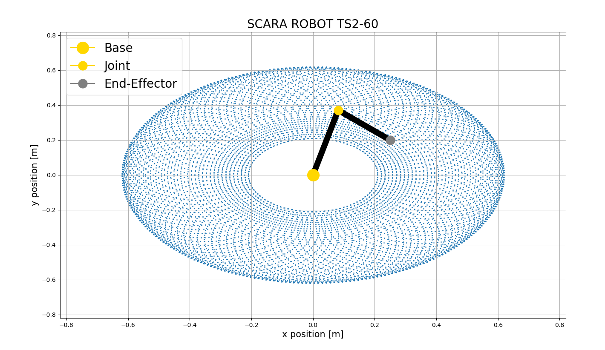

### Simple Inverse and Forward Kinematics 2DOF SCARA manipulator

**Object-Oriented Programming Course - VOB**

```javascript
Software
```
```
OS Ubuntu 20.04
Visual Studio Code
```
```javascript
Programming-Language, Library
```
```
C++(17)
- matplotlib-cpp
- meshgen(in project Numcpp_light.hpp)
```
```javascript
Algorithms
```
```
FK - "fast" - triogonometry approach
   - Denavit–Hartenberg table approach
IK - basic approach
   - Jacobian approach (in next version)
```

### Description
This is a program that has python programming access features, so it may not be completely optimal. Main goal was created modular and simple program in C++, for testing approach IK and FK for 2-link SCARA robot. Program use matplotlib-cpp and meshgen header file libraries. Matplolib-cpp call python matplotlib, in this library is issue with plot more 3Dplots! Inspiration came from lab.n.3 [VRM Course](https://github.com/rparak/Programming-for-robots-and-manipulators-VRM/tree/main/Lab/3). Program may be compile for Linux-based OS as well as for Windows OS, just edit compile settings -> [VS Code](https://code.visualstudio.com/docs/cpp/introvideos-cpp).




### Dependencies for build
* Python + matplotlib

### References
* [matplotlibcpp](https://github.com/lava/matplotlib-cpp)
* [meshgen](https://github.com/xiaohongchen1991/meshgen)