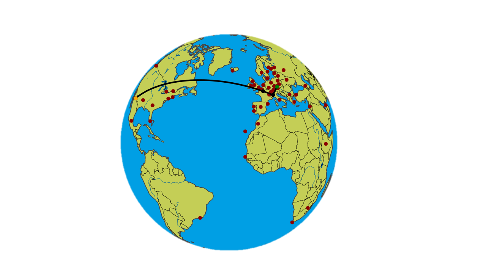

## A simple application of Dijkstra's algorithm for finding "air route"

**Mathematical Principles of Computer Science - VZI**

```javascript
Software
------------------------------------
| Python version 3.10
|   - Dash version 2.7.0
|   - GeoPy version 2.3.0
```

This is a simple representation of the use of the Dijkstra's Algorithm, where a synthetic database of nodes and edges has been created, where cities represent nodes and edges represent flight length. Accessing the database and adding additional parts is done from a simple console application *database.py*. The actual computation of the dijkstra algorithm is located in *dijkstra.py*. The entire application is then wrapped in the Plotly Dash graphical environment *app.py*. The data certainly has no real basis, only for demonstration of use.

I experimented with deploy the solution to Azure Cloud, but unsuccessful.

